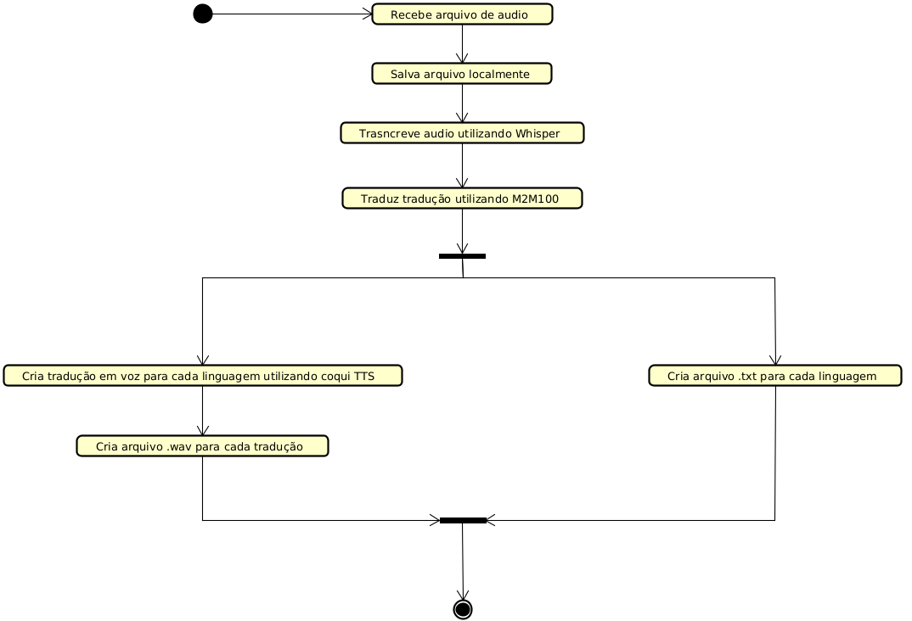

# API de Tradução

Esta API foi construida em Flask, com objetivo de realizar traduções automáticas a partir de **voz**, **texto** e **imagem**, retornando as traduções em **texto** e **áudio**.

## Funcionalidades

- Transcrição automática de áudios.
- Tradução multilingual.
- Extração de texto de imagens.
- Geração de áudio com voz.

## Detalhamento

### Modelos

para essa API foram utilizados os seguintes modelos:

- Whisper - OpenIA (para transcrição de audios)
- M2M100 - MetaIA (para a tradução)
- Coqui TTS - Mozilla (para a geração de voz)
- Tesseract OCR - Google (para extração de texto)

## Funcionamento

O funcionamento base das traduções acontece da seguinte maneira:



## Instalação

```bash
# Clone o repositório
git clone https://github.com/Marco-ACosta/trabalho-ia.git
cd trabalho-ia

# Crie e ative o ambiente virtual
python3 -m venv .venv
source .venv/bin/activate  # se for windows .venv\Scripts\activate

# Instale as dependências
pip install -r requirements.txt
```

> **Pré-requisitos**:
>
> - Python 3.8+
> - FFmpeg instalado
> - Tesseract instalado no sistema
> - Tesseraact disponível em `/usr/bin/tesseract`

## Executando

```bash
python3 run.py
```

A aplicação estará por padrão em: `http://localhost:5000`

## Rotas

### POST `voice/start`

Inicia uma nova sessão de tradução.

**Body** (form-data):

```json
{
  "origin": string,      // idioma de origem (ex: "en", "pt")
  "destiny": string[]    // lista de idiomas de destino (ex: ["es","fr"])
}
```

**Saída** (200 OK – JSON):

```json
{
  "session": string,     // ID da sessão gerada (timestamp)
  "languages": [
    {
      "language": string,            // código do idioma (ex: "pt")
      "is_origin": boolean,          // true se for o idioma de origem
      "upload_folder": string,       // pasta onde serão salvos uploads (ex: "123456789/uploads")
      "transcription_folder": string,// pasta das transcrições (ex: "123456789/transcriptions/pt")
      "voice_folder": string         // pasta dos arquivos de áudio (ex: "123456789/voice/pt")
    },
    …
  ]
}
```

---

### POST `voice/audio/{session}`

Envia um arquivo de áudio para tradução.

**Path Parameter**:

- `session`: string // ID da sessão

**Body** (form-data):

```json
{
  "audio": file         // arquivo de áudio .wav, .mp3, .m4a ou .ogg
}
```

**Saída**

- 200 OK (body vazio)
- 400 Bad Request / 404 Not Found (JSON):

```json
{
  "error": string      // mensagem de erro
}
```

---

### POST `voice/image/{session}`

Envia uma imagem para tradução.

**Path Parameter**:

- `session`: string // ID da sessão

**Body** (form-data):

```json
{
  "image": file         // arquivo de imagem .jpg ou .png
}
```

**Saída**

- 200 OK (body vazio)
- 400 Bad Request / 404 Not Found (JSON):

```json
{
  "error": string      // mensagem de erro
}
```

---

### POST `voice/text/{session}`

Envia texto para tradução.

**Path Parameter**:

- `session`: string // ID da sessão

**Body** (form-data):

```json
{
  "text": string        // texto a ser traduzido
}
```

**Saída**

- 200 OK (body vazio)
- 400 Bad Request / 404 Not Found (JSON):

```json
{
  "error": string      // mensagem de erro
}
```

---

### GET `voice/text/{session}/{lang}`

Faz o download do arquivo de texto com a tradução.

**Path Parameters**:

- `session`: string // ID da sessão
- `lang`: string // código do idioma desejado

**Saída**

- 200 OK – arquivo `.txt` (attachment)
- 400 Bad Request / 404 Not Found (JSON):

```json
{
  "error": string      // mensagem de erro
}
```

---

### GET `voice/audio/{session}/{language}`

Faz o download do áudio da tradução.

**Path Parameter**:

- `session`: string // ID da sessão
- `language`: string // código do idioma desejado

**Saída**

- 200 OK – arquivo `.wav` (attachment)
- 400 Bad Request / 404 Not Found (JSON):

```json
{
  "error": string      // mensagem de erro
}
```

---

### DELETE `voice/{session}`

Remove todos os arquivos e registros da sessão.

**Path Parameter**:

- `session`: string // ID da sessão a ser removida

**Saída**

- 204 No Content (JSON opcional):

```json
{
  "message": "Session removed."
}
```

- 404 Not Found (JSON):

```json
{
  "error": string      // mensagem de erro
}
```

## 📁 Estrutura de Pastas

```plaintext
sessions/
├── <session_id>/
│   ├── uploads/                 # Arquivos enviados
│   ├── transcriptions/         # Arquivos .txt traduzidos
│   │   └── <idioma>/
│   └── voice/                  # Áudios gerados com tradução falada
│       └── <idioma>/
```
